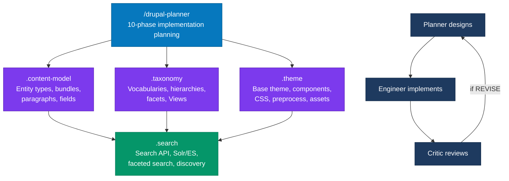

# drupal-planner

A Drupal-specific planning skill for [Claude Code](https://docs.anthropic.com/en/docs/claude-code) that designs implementation architectures before the first line of code is written. It produces specifications precise enough that a developer with zero context can implement them correctly on the first try — entity types with relationships, field structures, permission models, cache strategies, migration paths, and implementation task sequences with review checkpoints.

This is the companion planner to [drupal-critic](https://github.com/zivtech/drupal-critic). The planner designs architectures before code; the critic reviews implementations after code.

## The problem with unplanned Drupal implementations

Drupal's hardest bugs are design bugs. They originate before the first line of PHP:

- "Add a review system" → Developer creates a content type without specifying relationships to products, discovers later it's hard to query reviews-per-product, requires entity reference field addition and data migration.
- "Add caching to search results" → Developer caches without specifying cache tags, invalidation breaks in production when products change. Bugs are invisible until load tests.
- "We need a permission model" → Developer builds permissions without understanding when `hook_node_access` runs, creates privilege escalation bugs.
- "Migrate from our legacy system" → Developer writes migrations assuming they're idempotent, discovers mid-deployment that re-runs duplicate data.
- "Build a custom module for reviews" → Turns out contrib module `reviews_extra` exists, now we own security updates instead of upstream.

Every one of these is preventable with architectural planning upfront. The cheapest time to prevent a Drupal bug is before the first PHP file is written.

## How it works

drupal-planner runs a **10-phase planning protocol** that covers every architectural decision point in a Drupal implementation. Each phase builds on the previous, and hard gates prevent vague designs from passing through.

### Planning protocol

1. **Scope & Context** — Feature definition, Drupal version detection, constraint identification
2. **Existing Architecture Analysis** — Current entity types, modules, hooks, services, config strategy, conventions, pain points
3. **Data Model Design** — Entity types with one-sentence purposes, content vs config classification, bundles, fields (type/cardinality/required/widget), entity relationship diagram
4. **Module Architecture** — Contrib-first evaluation using the [contrib evaluation rubric](.claude/skills/drupal-planner/references/contrib-evaluation-rubric.md), custom module justification, plugin/service/hook responsibilities
5. **Configuration Schema** — Every config item classified (simple config / config entity / State API), schema definition, export strategy (config/install vs config/optional vs environment-specific)
6. **Permission & Access Model** — All permissions defined, role-to-permission mapping with rationale, workflow state transitions, field-level access
7. **Cache Strategy** — Every cacheable item tagged with contexts and max-age, invalidation triggers, Dynamic Page Cache / BigPipe compatibility
8. **Migration & Update Path** — Source-to-target mapping, Migrate API planning, idempotency guarantees, rollback strategy, `hook_update_N` sequencing
9. **Theme & Render Design** — Rendered components, view modes, templates, preprocess (thin — business logic in services), CSS/JS libraries, accessibility
10. **Implementation Tasks & Review Checkpoints** — TDD-sequenced tasks with exact files, test approach, and drupal-critic review focus areas

### Planning rubric

Every plan is evaluated against a [quality rubric](.claude/skills/drupal-planner/references/drupal-planning-rubric.md) covering 8 dimensions:

1. **Entity Design** — One-sentence purpose, content/config classification, relationship diagram, field specifications, state ownership justification
2. **Module Architecture** — Contrib-first evaluation, single responsibility, plugin types, service dependencies, hook documentation
3. **Configuration Schema** — Config classification, schema definition, export strategy, environment-sensitive exclusion
4. **Permission & Access Model** — Permission definitions, role mapping with rationale, workflow transitions, edge cases
5. **Cache Strategy** — Tags, contexts, max-age per item, invalidation triggers, DPC/BigPipe compatibility
6. **Migration & Update Path** — Entity mapping, Migrate API planning, idempotency, rollback, update hook sequencing
7. **Theme & Render** — Components, templates, thin preprocess, libraries, accessibility
8. **Implementation Tasks** — TDD rhythm, exact files, test approach, review checkpoints

### Contrib evaluation rubric

Every module decision uses a [structured evaluation framework](.claude/skills/drupal-planner/references/contrib-evaluation-rubric.md) weighing functionality match, security coverage, maintenance activity, download count, Drupal version support, issue queue health, code quality, and performance impact.

### Hard gates

Non-negotiable requirements that prevent vague designs:

- Every entity type MUST have its purpose defined in one sentence
- Every entity MUST have relationships documented
- Every custom module MUST justify why contrib doesn't solve the problem
- Every config item MUST be classified (simple config / config entity / State API)
- Every permission MUST be mapped to a role with rationale
- Every cacheable item MUST specify cache tags, contexts, and max-age
- Every migration MUST have idempotency and rollback strategy

### Calibrated output

Plans scale to feature complexity — no 15-page plans for adding a field:

| Feature Complexity | Expected Length | Required Sections |
|---|---|---|
| Simple (add field, minor config change) | 2-3 pages | Entity Design, Config Schema, Implementation Tasks |
| Medium (new content type with forms) | 5-8 pages | All except Migration (if not needed) |
| Complex (multi-entity with migration) | 10-15 pages | All sections, detailed |
| Critic fix (addressing REVISE findings) | 2-4 pages | Focused on specific architectural issues |

### Router pattern

The main planner also acts as a router: when the request is clearly focused on a specific subsystem, it suggests the appropriate sub-planner. See [sub-planner routing map](.claude/skills/drupal-planner/references/sub-planner-routing-map.md) for the full decision tree.

## Output format

Plans are saved to `docs/plans/YYYY-MM-DD-<feature-name>-drupal-plan.md` with this structure:

- **Feature overview**: What we're building, risk level, existing architecture summary
- **Entity Relationship Diagram**: All entity types and their references
- **Entity Type Design**: Purpose, type, bundles, fields, relationships, rationale
- **Module Architecture**: Responsibility, contrib/custom, plugins, services, hooks, justification
- **Configuration Schema**: Type classification, schema, exportability, rationale
- **Permission & Access Model**: Role-to-permission mapping with rationale, workflow transitions
- **Cache Strategy**: Tags, contexts, max-age, invalidation triggers per cacheable item
- **Migrations**: Source-target mapping, idempotency, rollback approach
- **Theme & Render**: Components, templates, preprocess, libraries, accessibility
- **Implementation Tasks**: TDD-sequenced with files, tests, permissions, cache, review checkpoints
- **Review Checkpoint Plan**: Which tasks trigger drupal-critic review and what to focus on

## What you get

Five slash commands installed into `~/.claude/`:

| Command | Agent | Purpose |
|---------|-------|---------|
| `/drupal-planner` | drupal-planner | Full 10-phase implementation planning (all subsystems) |
| `/drupal-planner.content-model` | drupal-content-model-planner | Entity types, bundles, paragraphs, field architecture, composition patterns |
| `/drupal-planner.taxonomy` | drupal-taxonomy-planner | Vocabularies, term hierarchies, faceted navigation, Views integration |
| `/drupal-planner.theme` | drupal-theme-planner | Base theme, components (SDC), CSS, preprocess, assets, accessibility |
| `/drupal-planner.search` | drupal-search-planner | Search API, Solr/Elasticsearch, facets, Views, autocomplete, discovery |

Each sub-planner is focused — use when planning is scoped to one subsystem. Use the main planner when planning spans multiple concerns or a full feature.

All agents run at Opus tier and produce architecture specifications, not implementation code.

## Install

### As skills (adds slash commands)

```bash
git clone https://github.com/zivtech/drupal-planner.git
cp -r drupal-planner/.claude/skills/* ~/.claude/skills/
```

Or with [npx claude-skills](https://www.npmjs.com/package/claude-skills):

```bash
npx claude-skills add https://github.com/zivtech/drupal-planner
```

### As agents (adds to agent list)

```bash
cp drupal-planner/.claude/agents/*.md ~/.claude/agents/
```

### Both

Install both for maximum flexibility. Skills give you the `/drupal-planner` and `/drupal-planner.*` slash commands. Agents give you planners that can be invoked by other agents or by name.

## Usage

### Skill (slash command)

```
/drupal-planner Plan a product review system with ratings, moderation, and search
/drupal-planner.content-model Redesign our content model for landing pages, blogs, and case studies
/drupal-planner.taxonomy Design a taxonomy for e-commerce product categorization
/drupal-planner.theme Plan theme architecture for a Drupal 11 site using SDC
/drupal-planner.search Plan search for a 100k+ article content site with facets
```

### Agent (via agent picker or other agents)

The agents at `~/.claude/agents/drupal-*.md` are automatically available in Claude Code's agent system. They run at Opus tier — they plan but do not implement.

### When to use each command (Jobs To Be Done)

**`/drupal-planner`** — Full implementation planning

- When I'm starting a new feature that touches entities, permissions, cache, and theme, I want a complete architecture plan so I can hand it to a developer who implements it correctly without back-and-forth.
- When I'm migrating a legacy site to Drupal, I want a migration architecture with source-target mapping and rollback strategy so I can execute the migration confidently without data loss.
- When I have a drupal-critic REVISE verdict, I want a focused redesign plan for the specific architectural issues so I can fix the root cause instead of patching symptoms.
- When I need to refactor a module that's grown unwieldy, I want a clear plan for splitting responsibilities so I can break the work into safe, reviewable steps.

**`/drupal-planner.content-model`** — Content model architecture

- When I'm redesigning a site with a flat "Page" content type, I want a content model plan with entity types, bundles, and field architecture so I can migrate to a structured model without creating entity proliferation.
- When I need to decide between Paragraphs, Layout Builder, and block content, I want a composition pattern analysis so I can choose the approach that matches my editors' workflow.
- When I'm adding a new content type and I'm not sure how it relates to existing entities, I want a relationship diagram so I can avoid orphaned references and query performance problems.

**`/drupal-planner.taxonomy`** — Taxonomy and classification

- When I'm building an e-commerce site and need product categorization, I want a vocabulary structure with hierarchy depth and facet configuration so I can support both browsing and filtering without term explosion.
- When I have overlapping tags and categories that confuse editors, I want a taxonomy consolidation plan so I can clean up the classification without breaking existing content references.
- When I need faceted navigation on a content listing, I want a plan that connects vocabularies to the Facets module and Views so I can implement filtering that actually works with Drupal's cache layer.

**`/drupal-planner.theme`** — Theme architecture

- When I'm starting a Drupal 11 site and need to choose between Starterkit, Olivero, and a custom base theme, I want a theme architecture plan so I can avoid a decision that's expensive to reverse after templates are built.
- When I need to adopt a component-based approach (SDC) and don't know how it fits with our existing theme, I want a component strategy and CSS methodology so I can migrate incrementally without breaking the site.
- When preprocess functions are accumulating business logic, I want a theme refactoring plan so I can move logic to services while keeping templates thin and testable.

**`/drupal-planner.search`** — Search and discovery

- When I'm building search for a content-heavy site and need to choose between Solr, Elasticsearch, and the database backend, I want a backend comparison with my specific content volume and query patterns so I can pick the right backend before committing to infrastructure.
- When I need faceted search on a content listing, I want a Search API index design with field mapping and processor selection so I can build facets that are fast, relevant, and cache-friendly.
- When users are getting poor search results and high zero-result rates, I want a search architecture review and redesign plan so I can improve discoverability without starting from scratch.

### When not to use it

- Reviewing existing Drupal code — use [drupal-critic](https://github.com/zivtech/drupal-critic) instead
- Writing implementation code — use a development agent or workflow instead
- General Drupal questions ("what's an entity?") — just ask directly

## Quick start examples

### Plan a full feature

```
/drupal-planner

> Design a new content type "Product Review" with ratings (1-5 stars),
> review text, author, and publication date. Content should be publishable
> immediately or scheduled. Include permissions so only admins approve reviews.
```

Returns a 10-phase plan with entity type definitions, field specifications, permission model, caching strategy, and implementation tasks.

### Plan content model only

```
/drupal-planner.content-model

> We're redesigning our website. Currently we have a flat "Page" content type.
> We need to support Landing Pages, Blog Posts, Case Studies, and Team Member
> profiles. Plan the content model.
```

Returns entity type specifications, bundle decisions, paragraph architecture, and field relationships.

### Plan taxonomy

```
/drupal-planner.taxonomy

> Design a taxonomy for an e-commerce site. We need to categorize products,
> support multi-level categories, and enable faceted filtering.
```

Returns vocabulary structure, term hierarchy, facet configuration, and Views integration.

### Plan theme architecture

```
/drupal-planner.theme

> We're building a Drupal 11 site. Should we use Starterkit, Olivero, or a custom theme?
> Plan the theme architecture including components and CSS strategy.
```

Returns base theme decision, component strategy (SDC vs traditional), CSS architecture, asset management.

### Plan search

```
/drupal-planner.search

> Plan the search architecture for a content site with 100k+ articles.
> We need faceted search by category, author, and date. What backend?
```

Returns Search API index design, field mapping, processor selection, facet configuration, Views page layout.

## Sub-planner selection

Use this table to pick the right command:

| You want to design... | Use this command |
|-----------------------|------------------|
| Entity types, bundles, paragraphs, field architecture | `/drupal-planner.content-model` |
| Vocabularies, classification, hierarchies, facets | `/drupal-planner.taxonomy` |
| Theme, components, CSS, preprocess, assets | `/drupal-planner.theme` |
| Search indexes, facets, discovery, Views search pages | `/drupal-planner.search` |
| A full feature (touches multiple subsystems) | `/drupal-planner` |
| A Drupal migration or module refactor | `/drupal-planner` |

## Relationship with drupal-critic

drupal-planner designs architectures before code. [drupal-critic](https://github.com/zivtech/drupal-critic) reviews implementations after code. They form a feedback loop:

```
Planner designs → Engineer implements → Critic reviews →
  (if REVISE) → Planner plans fixes → Engineer re-implements → Critic re-reviews
```

| | drupal-planner | drupal-critic |
|---|---|---|
| **Scope** | Architecture design before implementation | Code review after implementation |
| **Output** | Architecture specification documents | Structured review with verdict |
| **Domain checks** | 10-phase protocol, 8-dimension rubric | 9-dimension rubric, context-driven perspectives |
| **Hard gates** | Entity purpose, permission mapping, cache tags, migration idempotency | Evidence-backed findings, confidence-gated self-audit |
| **External skills** | 3 reference documents (rubrics, routing map) | Orchestrates up to 3 of 24 pinned external Drupal skills per run |
| **Best used for** | New features, content model redesigns, migrations, module architecture | Module updates, cache behavior, config sync, contrib patches |

Each sub-planner also has a companion critic:

| Planner | Companion Critic | Repo |
|---------|-----------------|------|
| `/drupal-planner` | `drupal-critic` | [zivtech/drupal-critic](https://github.com/zivtech/drupal-critic) |
| `/drupal-planner.content-model` | `content-model-critic` | [zivtech-meta-skills](https://github.com/zivtech/zivtech-meta-skills) |
| `/drupal-planner.taxonomy` | `taxonomy-critic` | [zivtech-meta-skills](https://github.com/zivtech/zivtech-meta-skills) |
| `/drupal-planner.theme` | `drupal-theme-critic` | [zivtech-meta-skills](https://github.com/zivtech/zivtech-meta-skills) |
| `/drupal-planner.search` | `search-discovery-critic` | [zivtech-meta-skills](https://github.com/zivtech/zivtech-meta-skills) |

## Multi-planner workflows

For complex projects, multiple planners work in sequence:

### New site build
1. `/drupal-planner.content-model` — Design entity types and field architecture
2. `/drupal-planner.taxonomy` — Design classification system
3. `/drupal-planner.search` — Design search and discovery
4. `/drupal-planner.theme` — Design theme architecture
5. `/drupal-planner` — Tie together with permissions, cache, migrations

### Content model redesign
1. `/drupal-planner.content-model` — Redesign entities and fields
2. `/drupal-planner.taxonomy` — Update taxonomy to match new model
3. `/drupal-planner` — Plan migration from old to new model

### Search overhaul
1. `/drupal-planner.search` — Design new search architecture
2. `/drupal-planner.taxonomy` — Align taxonomies with facet requirements
3. `/drupal-planner` — Plan implementation tasks and review checkpoints

## Referenced companion skills

drupal-planner works with external skills when they are installed:

### Design phase
- [**brainstorming**](https://github.com/obra/superpowers) by obra — Explore multiple architecture options before committing. Invoked automatically for new features.
- [**writing-plans**](https://github.com/obra/superpowers) by obra — Convert designs into structured implementation tasks.

### Code understanding
- [**code-archaeology**](https://github.com/flonat/claude-research) by flonat — Understand existing modules before planning modifications.

### Implementation
- [**test-driven-development**](https://github.com/obra/superpowers) by obra — TDD for Drupal with PHPUnit and Kernel tests.
- [**executing-plans**](https://github.com/obra/superpowers) by obra — Batch execution with checkpoints.

### Verification
- [**drupal-critic**](https://github.com/zivtech/drupal-critic) by Zivtech — Harsh code review at checkpoints.
- **drupal-coding-standards** (zivtech-claude-skills) — Drupal coding standards compliance.

## Architecture



## Compatibility

- **Claude Code**: Works standalone, no plugins required.
- **drupal-critic**: Designed to complement drupal-critic. Planner designs the architecture, critic reviews the implementation.
- **Drupal versions**: Supports Drupal 7, 10, 11, and CMS. Auto-detects version from `composer.json`.

## What's included

```
.claude/
  agents/
    drupal-planner.md                      # Main planner agent (10-phase protocol)
    drupal-content-model-planner.md        # Content model agent
    drupal-taxonomy-planner.md             # Taxonomy agent
    drupal-theme-planner.md                # Theme agent
    drupal-search-planner.md               # Search agent
  skills/
    drupal-planner/
      SKILL.md                             # Main skill definition + sub-planner router
      references/
        contrib-evaluation-rubric.md       # Contrib vs custom decision framework
        drupal-planning-rubric.md          # Planning output quality checklist
        sub-planner-routing-map.md         # Sub-planner selection logic
    drupal-planner.content-model/
      SKILL.md                             # Content model sub-planner skill
    drupal-planner.taxonomy/
      SKILL.md                             # Taxonomy sub-planner skill
    drupal-planner.theme/
      SKILL.md                             # Theme sub-planner skill
    drupal-planner.search/
      SKILL.md                             # Search sub-planner skill
CLAUDE.md                                  # Project instructions
AGENTS.md                                  # Agent registry
```

## License

Apache License 2.0. See [LICENSE](LICENSE).

## Related

- [drupal-critic](https://github.com/zivtech/drupal-critic) — Review Drupal code for architecture and maintainability
- [harsh-critic](https://github.com/zivtech/harsh-critic) — General-purpose structured review protocol (drupal-critic's foundation)
- [zivtech-meta-skills](https://github.com/zivtech/zivtech-meta-skills) — Companion critics (content-model, taxonomy, theme, search)
- [obra/superpowers](https://github.com/obra/superpowers) — Brainstorming, plan writing, TDD, verification
